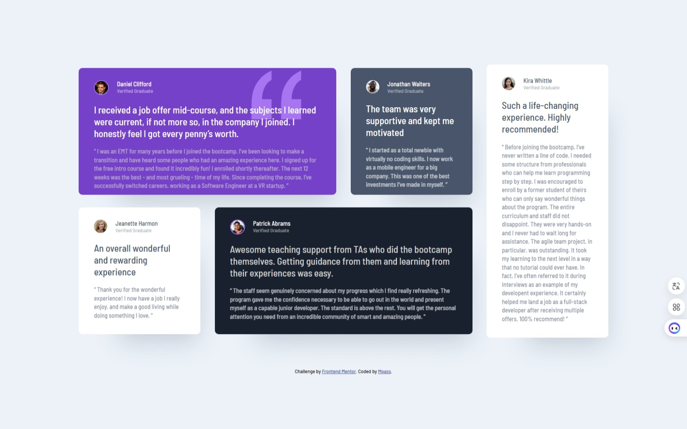

## Table of contents

- [Overview](#overview)
  - [The challenge](#the-challenge)
  - [Screenshot](#screenshot)
  - [Links](#links)
- [My process](#my-process)
  - [Built with](#built-with)
  - [What I learned](#what-i-learned)
  - [Continued development](#continued-development)
- [Author](#author)

## Overview

### The challenge

Users should be able to:

- View the optimal layout depending on their device's screen size

### Screenshot

-Desktop

-Mobile

### Links

- Solution URL: [https://github.com/Benson0721/Grid-testimonials]
- Live Site URL: [https://benson0721.github.io/Grid-testimonials/]

## My process

### Built with

- Semantic HTML5 markup
- CSS custom properties
- CSS grid layout
- Flexbox
- Scss
- Postcss
- Mobile-first workflow
- [React](https://reactjs.org/) - JS library

### What I learned

I’ve been working on another grid challenge. To be honest, I don’t think the grid layout itself is too difficult. However, I’ve realized that I have some misunderstandings about basic CSS concepts while using grid. This practice requires applying identical color designs to each section, and organizing the CSS has been a challenge for me. I think that’s why I’ve spent almost four hours on it!

### Continued development

I want to get more familiar with react and grid layout, so I will keep practise that in the futrue practise!
And I want to use tailwind css framework next time!

## Author

- Github - [Mpass](https://github.com/Benson0721)
- Frontend Mentor - [@Mpass](https://www.frontendmentor.io/profile/Benson0721)
